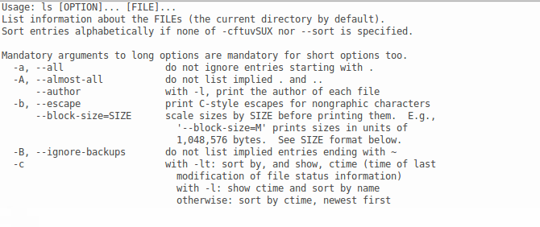
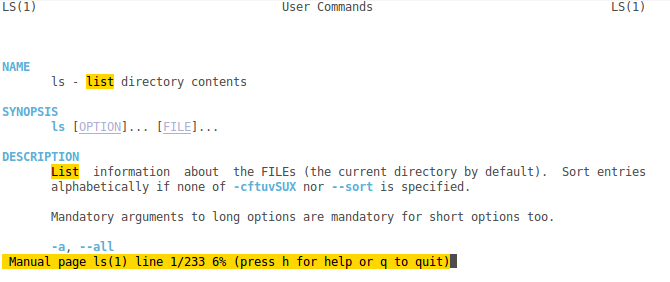

# Atelier CLI, obtenir de l'aide sur une commande

## Préambule

> Ce document s'adresse aux participants des [ateliers CLI organisés au LabX](https://www.labx.fr/) (_hackerspace_ de Bordeaux) à un publique **débutant**.
> 
> Il est évident que certains concepts sont simplifiés pour s'adapter au public. 

Si toutefois vous trouvez des erreurs, merci de les signaler à l'auteur: [@edouard_lopez](https://twitter.com/edouard_lopez).

## La casse (majuscule/minuscule) sous linux

Le système Linux est sensible à la casse, c'est-à-dire que la **distinction entre majuscules et minuscules est importante**. Notamment dans les commandes, noms de fichiers et autres. 

```bash
ls -a # 
ls -A # c'est différent !
```

## Accéder à l'aide

Deux façon pour accéder à l'aide d'une commande seront décrites dans ce document:

* aide concise avec l'option `--help` (parfois `-?` ou `-h`) :

        ls --help


* page de manuel, plus complète et facilite la lecture :

        man ls


### Syntaxe de l'aide

L'aide nous indique d'abord la forme générique de la commande

* `ls [OPTION]... [FILE]...` prend des arguments (cf. [plus bas](#Description générique)).

Dans notre cas, la commande se décompose comme suit:

* `ls` ← la commande pour laquelle on veut de l'aide ;
* `--help` ← l'option que l'on passe à la commande `ls` (pour modifier le comportement).

### Options: forme longue vs. forme courte

La forme longue utilise des mots complets tandis (p. ex. `--directory`) que la forme courte utilise une seule lettre (p. ex.  `-d`), permettant des commandes plus concises donc moins de risques d'erreurs de frappes.

Il est courant que la forme courte utilise la première lettre de la forme longue:
```bash
ls -all
ls -a   # c'est pareil
```
Mais ce n’est pas toujours le cas, la forme courte et alors _différente_ de la forme longue:

```bash
ls --escape 
ls -b       # différent
```

## Description générique

L'aide commence par la ligne `usage: ls [OPTION]... [FILE]...`, qui nous donnes les informations suivantes sur l'usage de la commande `ls`:

* `ls [OPTION]... [FILE]...` indique que `ls` prend deux types d'arguments: des _options_ et des _fichiers_ (cf. [plus bas](#Description générique)).
### `[ ]` les crochets

Signifie que l'argument est optionnel. Par exemple,
```bash
ls
```
est la forme la plus simple, uniquement la commande.
```bash
ls -l
```
On passe une option pour activer le format d'affichage long (taille, droit, date du fichier).

### `[ ]...` 3 points de suspension
Signifie que cet argument peut être répété.

* `[OPTION]...` le premier argument signifie que l'on peut passer **une ou plusieurs options** à la commande pour modifier son comportement de base ;

        ls -l -a
        ls -la   # inutile de répéter le tiret
        ls -al   # l'ordre des options est sans importance

* `[FILE]...` le second argument de la commande corresponds à des noms de _fichiers_. Après une option, on peut indiquer un ou plusieurs fichiers auquel appliquer la commande. Par exemple:

        ls fichier1.txt fichier2.txt
        ls fichier1.txt dossier/

* `ls [OPTION]... [FILE]...` la forme complète signifie que l'on peut faire des combinaisons d'options et de noms de fichiers:

        ls -la fichier1.txt dossier/

## Concept de _fichier_ et _répertoire_

Sur Linux **tout est fichier[¹](https://en.wikipedia.org/wiki/Everything_is_a_file)[²](http://www.howtogeek.com/117939/htg-explains-what-everything-is-a-file-means-on-linux/)**. Il existe un fichier pour chacun de vos documents, disques, CD/DVD, USB, claviers et autres périphériques. Un fichier peut être de différente nature, par exemple cela peut être un simple document (PDF, doc, etc.), un répertoire, c'est-à-dire un fichier qui contient d'autres fichier ou répertoire.

Remarque : un répertoire est un type de fichier qui peut en contenir d'autre (fichier ou répertoire)

Remarque : les termes _répertoire_, _dossier_ sont équivalent. En anglais ils correspondent respectivement à _directory_ et _folder_.

## Notion de chemin

## Chemin absolue vs. relatif

    analogie avec la maison :

    ./relatif/ ← je suis dans la chambre, regarder sur l'étagère

    /chemin/absolu ← je rentre dans la maison, je vais dans la chambre et je regarde sur l'étagère

Tapez votre commande il explique → http://explainshell.com/explain?cmd=ls+-a