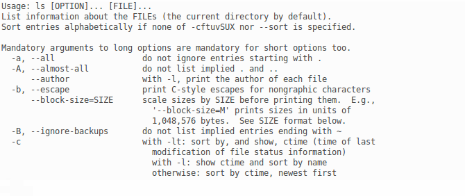

# Atelier CLI, obtenir de l'aide sur une commande

## Préambule

> Ce document s'adresse aux participants des [ateliers CLI organisés au LabX](https://www.labx.fr/) (_hackerspace_ de Bordeaux) à un publique **débutant**.
> 
> Il est évident que certains concepts sont simplifiés pour s'adapter au public. 

Si toutefois vous trouvez des erreurs, merci de les signaler à l'auteur via : 

* Mail : [dev+clilabx@edouard-lopez.com](dev+clilabx@edouard-lopez.com) ;
* Twitter : [@edouard_lopez](https://twitter.com/edouard_lopez) ;
* IRC : #giroll ou #labx ;
* en venant discuter à [Giroll](http://giroll.org/), au [LabX](www.labx.fr/), au [Node](http://bxno.de/) ou autres.

## La casse (majuscule/minuscule) sous linux

Le système Linux est sensible à la casse, c'est-à-dire que la **distinction entre majuscules et minuscules est importante**. Notamment dans les commandes, noms de fichiers et autres. 

```bash
ls -a # 
ls -A # c'est différent !
```

## Accéder à l'aide

Deux façon pour accéder à l'aide d'une commande (ici `ls`[⁵](https://fr.wikipedia.org/wiki/Ls)) seront décrites dans ce document:

* aide concise avec l'option `--help` (parfois `-?` ou `-h`) :

        ls --help


* page de manuel, plus complète et facilite la lecture :

        man ls


### Syntaxe de l'aide

L'aide nous indique d'abord la forme générique de la commande

* `ls [OPTION]... [FILE]...` prend des arguments (cf. [plus bas](#description-générique)).

Dans notre cas, la commande se décompose comme suit:

* `ls` ← la commande pour laquelle on veut de l'aide ;
* `--help` ← l'option que l'on passe à la commande `ls` (pour modifier le comportement).

### Options: forme longue vs. forme courte

La forme longue utilise des mots complets tandis (p. ex. `--directory`) que la forme courte utilise une seule lettre (p. ex.  `-d`), permettant des commandes plus concises donc moins de risques d'erreurs de frappes.

Il est courant que la forme courte utilise la première lettre de la forme longue:
```bash
ls -all
ls -a   # c'est pareil
```
Mais ce n’est pas toujours le cas, la forme courte et alors _différente_ de la forme longue:

```bash
ls --escape 
ls -b       # différent
```

## Description générique

L'aide commence par la ligne `usage: ls [OPTION]... [FILE]...`, qui nous donnes les informations suivantes sur l'usage de la commande `ls`:

* `ls [OPTION]... [FILE]...` indique que `ls` prend deux types d'arguments: des _options_ et des _fichiers_ (cf. [plus bas](#Description générique)).
### `[ ]` les crochets

Signifie que l'argument est optionnel. Par exemple,
```bash
ls
```
est la forme la plus simple, uniquement la commande.
```bash
ls -l
```
On passe une option pour activer le format d'affichage long (taille, droit, date du fichier).

### `[ ]...` 3 points de suspension
Signifie que cet argument peut être répété.

* `[OPTION]...` le premier argument signifie que l'on peut passer **une ou plusieurs options** à la commande pour modifier son comportement de base ;

        ls -l -a
        ls -la   # inutile de répéter le tiret
        ls -al   # l'ordre des options est sans importance

* `[FILE]...` le second argument de la commande corresponds à des noms de _fichiers_. Après une option, on peut indiquer un ou plusieurs fichiers auquel appliquer la commande. Par exemple:

        ls fichier1.txt fichier2.txt
        ls fichier1.txt dossier/

* `ls [OPTION]... [FILE]...` la forme complète signifie que l'on peut faire des combinaisons d'options et de noms de fichiers:

        ls -la fichier1.txt dossier/

## Concept de _fichier_ et _répertoire_

Sur Linux **tout est fichier[¹](https://en.wikipedia.org/wiki/Everything_is_a_file)[²](http://www.howtogeek.com/117939/htg-explains-what-everything-is-a-file-means-on-linux/)**. Il existe un fichier pour chacun de vos documents, disques, CD/DVD, USB, claviers et autres périphériques. Un fichier peut être de différente nature, par exemple: 

* un _document_ (PDF, doc, etc.) ;
* un _répertoire_, c'est-à-dire un fichier qui contient des documnents ou d'autres fichiers (p. ex. des répertoires). 
* un périphérique (ou _device_) ;
* etc.

Les termes _répertoire_[³](https://fr.wikipedia.org/wiki/R%C3%A9pertoire_%28informatique%29) et _dossier_ sont équivalent, et en anglais correspondent respectivement à _directory_ et _folder_.

## Chemin vers les fichiers

Linux rattache tous les fichiers –périphériques et répertoires– à un répertoire dit « racine » et représenter par un simple `/` (_slash_). Pour accéder à un fichier, on indique le chemin pour l'atteindre soit :

* chemin _absolue_, en partant de la racine ;
* chemin _relative_, en partant du répertoire courant (cf. résultat de `pwd`).

Dans un chemin vers un fichier, les répertoires sont séparés par un `/` (_slash_):

* `/` ← la racine du système ;
* `/home/` ← répertoire utilisateurs ;
* `/home/ed8/` ← répertoire de l'utilisateur `ed8` ;
* `/dev` ← répertoire des périphériques ;

### Analogie avec la maison

* **Chemin absolu**

        /maison/couloir/chambre/étagère/livre.pdf

    Je rentre dans la _maison_, je passe par le _couloir_ puis je vais dans la _chambre_ et je regarde sur l'_étagère_ pour prendre le _livre_.

* **Chemin relatif**

        ./étagère/livre.pdf

    Sachant que je suis dans la _chambre_, je regarde sur l'_étagère_ et je prends le _livre_.

### Chemin absolue 

On indique le chemin complet vers le fichier que l'on souhaite manipuler, c'est-à-dire tous les répertoires que l'on traverse en partant de la racine.

    ls /var/log/ 

On liste le contenu du répertoire `log/`, qui contient les fichiers de journalisation du système (garde une trace de ce qui se passe).

    ls /home/ed8/

Liste le contenu du répertoire de l'utilisateur `ed8`. Maintenant listons également les fichiers cachés (ceux débutants par un `.`):

    ls -a /home/ed8/

Le résultat affiche beaucoup plus de fichiers que sans l'option `-a`. Il s'agit des fichiers cachés.

### Chemin relatif

Relatif sous-entends par rapport au répertoire dans lequel nous sommes (essayer la commande `pwd`), on parle également de répertoire de travail. Il n'est donc pas nécessaire de répéter le chemin depuis la machine jusqu'à ce répertoire. Dans la suite nous nous placerons dans le répertoire `/home/`.

Nous commencerons par lister les fichiers cachés de ce répertoire :

    ls -a /home/
On obtient par exemple :

    .  ..  ed8  labx  lost+found

Détaillons le résultat:

* `.` fait référence au _répertoire courant_ dans notre cas `.` est équivalent à `/home/` ;
* `..` désigne le _répertoire parent_ qui dans notre cas correspond à la racine `/` ;
* `ed8` et `labx` sont des répertoires utilisateurs ;
* `lost+found` est un répertoire système qui stocke les fichiers défectueux ou « supprimés »[⁴](http://unix.stackexchange.com/a/18157/17362).

Si l'on se place **maintenant dans le répertoire `/home/ed8/`** et que l'on exécute la commande `ls ..` (chemin relatif), cela revient à lister le répertoire parent `ls /home/` (chemin absolu).

On peut bien sûr chaîner les syntaxes :

* `ls`, `ls .`, `ls ./` sont identiques et liste `ls /home/ed8/` ;
* `ls ..`, `ls ../`, `ls ./../` sont équivalents à faire `ls /home/`.

## Références

Un site qui explique (en anglais) les commandes: [http://explainshell.com/explain?cmd=ls+-a](http://explainshell.com/explain?cmd=ls+-a)
